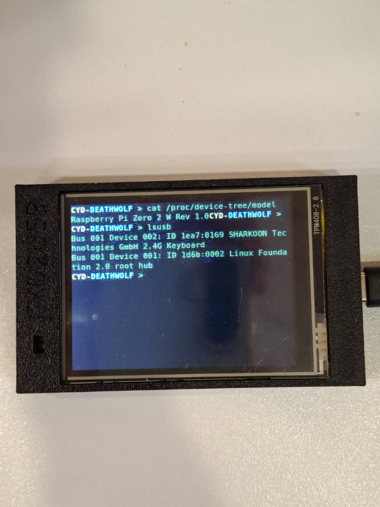

# 🖥️ CYD Wireless Terminal & Remote Screen Mirror

[](https://www.python.org/)
[](https://www.espressif.com/)
[](https://www.arduino.cc/)
[](https://websockets.readthedocs.io/)
[](LICENSE)

> Turn your **$10 ESP32 "Cheap Yellow Display" (CYD / ESP32-2432S028)** into a wireless, ultra-responsive remote monitor, touch digitizer, and standalone Linux terminal for **Raspberry Pi** and **PC**.

<p align="center">
  
</p>

---

## 🌟 Highlights

- **⚡ Smart Delta JPEG Streaming**: Captures screen, computes pixel bounding-box differences with OpenCV, and streams only modified pixels to minimize Wi-Fi bandwidth and achieve snappy ~15-30 FPS.
- **⌨️ Hardware-Level Keyboard Forwarder**: Forwards physical USB/2.4G wireless keyboards plugged into the Raspberry Pi directly into X11 (`XTest fake_input`), enabling 100% native typing, uppercase (`Shift`), hotkeys (`Ctrl+C`, `Ctrl+D`, `Ctrl+L`), Numpad, and auto-hotplug detection.
- **👆 Touchscreen as Mouse Digitizer**: Touch the CYD display to click, drag, and interact with the desktop or terminal in real time.
- **📟 Headless Virtual Terminal**: Run a headless Raspberry Pi (Lite OS) with a virtual `Xvfb` display, `matchbox-window-manager`, and auto-respawning `xterm`.
- **🚀 Zero-Downtime Systemd Services**: Auto-boots on startup, self-heals upon disconnect, and includes one-command SSH automated deployment (`deploy.py`).

---

## 📐 System Architecture

```
+-------------------------------------------------------------------------+
|                          RASPBERRY PI / PC                              |
|                                                                         |
|  +---------------------------+        +------------------------------+  |
|  | Physical USB/2.4G Keyboard|        |      Virtual Display         |  |
|  |     (/dev/input/event*)   |        |   Xvfb :1 (320x240 @ 24-bit) |  |
|  +-------------+-------------+        +--------------+---------------+  |
|                | (evdev)                             |                  |
|                v                                     v                  |
|  +---------------------------+        +------------------------------+  |
|  |   keyboard_forwarder.py   |        |    matchbox-wm + xterm       |  |
|  | (X11 XTest fake_input)    |------->|   (auto-focus & respawn)     |  |
|  +---------------------------+        +--------------+---------------+  |
|                                                      | (mss capture)    |
|  +---------------------------------------------------+---------------+  |
|  |  screen_server.py (OpenCV delta diff + JPEG compression)          |  |
|  +-----------------------------------+-------------------------------+  |
+--------------------------------------|----------------------------------+
                                       | WebSocket (TCP 8080)
                                       |  • Binary: [X:2B][Y:2B][JPEG Bytes]
                                       |  • Text:   "M:x,y,state" (Touch)
                                       v
+-------------------------------------------------------------------------+
|                  ESP32 "CHEAP YELLOW DISPLAY" (CYD)                     |
|                                                                         |
|  +------------------------+             +----------------------------+  |
|  | TJpg_Decoder + TFT_eSPI|             |   XPT2046 Touch Sensor     |  |
|  | 320x240 Color LCD      |             | (50ms rate-limited poll)   |  |
|  +------------------------+             +----------------------------+  |
+-------------------------------------------------------------------------+
```

---

## 🛠️ Hardware Requirements

| Component | Model | Description |
| :--- | :--- | :--- |
| **Microcontroller & Display** | ESP32-2432S028 | "Cheap Yellow Display" (CYD) 2.8" 320x240 TFT LCD with Touch |
| **Host System** | Raspberry Pi (Zero 2W / 3 / 4 / 5) or PC | Running Raspberry Pi OS / Linux / Windows |
| **Input Device** | USB or 2.4GHz Wireless Keyboard | Plugged directly into the Raspberry Pi |
| **Network** | 2.4GHz Wi-Fi Router or AP | Host and ESP32 must be on the same local network |

---

## 🚀 Quickstart Guide

### 1. Raspberry Pi / Host Setup

Install prerequisites on the Raspberry Pi:
```bash
sudo apt update
sudo apt install -y xvfb xterm matchbox-window-manager xdotool python3-pip python3-venv
```

Clone the repository and set up the Python environment:
```bash
git clone https://github.com/WoobWarb/cyd-pi-terminal.git ~/cyd-screen
cd ~/cyd-screen
python3 -m venv venv
source venv/bin/activate
pip install websockets mss opencv-python numpy pynput evdev python-xlib
```

### 2. Flash ESP32 Firmware

1. Open [`cyd_firmware/cyd_firmware.ino`](file:///d:/00_Python/Pi_with_yellow_Screen%202/cyd_firmware/cyd_firmware.ino) in **Arduino IDE** (or PlatformIO).
2. Install required libraries via Library Manager:
   - `TFT_eSPI`
   - `TJpg_Decoder`
   - `WebSockets` (by Markus Sattler)
3. Update Wi-Fi and Host IP in the code:
   ```cpp
   const char* WIFI_SSID     = "YOUR_WIFI_SSID";
   const char* WIFI_PASSWORD = "YOUR_WIFI_PASSWORD";
   const char* PI_IP         = "192.168.1.100"; // IP address of Raspberry Pi
   const uint16_t PI_PORT    = 8080;
   ```
4. Select board **ESP32 Dev Module** and flash to the CYD board.

### 3. Run & Test

#### Manual Testing:
```bash
# Terminal 1 (Starts Xvfb, xterm, matchbox, and screen_server.py):
chmod +x start_cyd_terminal.sh
./start_cyd_terminal.sh

# Terminal 2 (Starts hardware keyboard forwarder):
sudo DISPLAY=:1 ~/cyd-screen/venv/bin/python ~/cyd-screen/keyboard_forwarder.py
```

#### Run as System Services (Auto-start on Boot):
```bash
sudo cp cyd-screen.service /etc/systemd/system/
sudo cp cyd-keyboard.service /etc/systemd/system/
sudo systemctl daemon-reload
sudo systemctl enable --now cyd-screen.service
sudo systemctl enable --now cyd-keyboard.service
```

---

## ⚡ Automated 1-Click Deployment (`deploy.py`)

If developing on a PC, you can sync code, install packages, and restart services on the Raspberry Pi with a single command:

```bash
python deploy.py <PI_SSH_PASSWORD>
```

---

## 📡 Protocol Specification

### Screen Frame (Host → CYD)
Binary payload over WebSocket (`ws://<HOST_IP>:8080/screen`):

| Offset (Bytes) | Type | Field | Description |
| :--- | :--- | :--- | :--- |
| `0..1` | `uint16` (Big-endian) | `X` | Bounding box X coordinate (0..320) |
| `2..3` | `uint16` (Big-endian) | `Y` | Bounding box Y coordinate (0..240) |
| `4..N` | `bytes` | `JPEG Stream` | OpenCV JPEG compressed image data |

### Touch Input (CYD → Host)
Plaintext string sent when touch state changes or continues:
```text
M:<x>,<y>,<state>
```
- `x`, `y`: Screen coordinates in 320x240 space.
- `state`: `1` (Pressed / Touch down), `0` (Released / Touch up).

---

## 📂 Repository Structure

```
.
├── cyd_firmware/
│   └── cyd_firmware.ino         # ESP32 Arduino firmware (TFT_eSPI + TJpgDec + WS)
├── screen_server.py             # Screen capture & delta compression WebSocket server
├── keyboard_forwarder.py        # Hardware-level X11 keyboard forwarding engine
├── start_cyd_terminal.sh        # Virtual display & terminal launcher script
├── cyd-screen.service           # Systemd service for screen streaming
├── cyd-keyboard.service         # Systemd service for keyboard forwarding
├── deploy.py                    # Automated SSH/SFTP deployment script
├── CLAUDE.md                    # Technical reference & architecture notes
└── README.md                    # Project documentation
```

---

## 🤝 Contributing

Pull requests and issues are welcome! Feel free to contribute enhancements such as audio streaming, higher FPS compression algorithms, or multi-window manager improvements.

## 📄 License

This project is licensed under the **MIT License** - see the [LICENSE](LICENSE) file for details.
